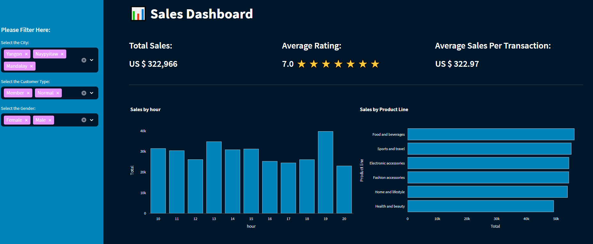

# Interactive Dashboard with Python – Streamlit

Sales Dashboard built-in Python and the Streamlit library to visualize Excel data.

## Run the app
```Powershell
# vanilla terminal
streamlit run app.py

# quit
ctrl-c
```

## Demo
Sales Dashboard: https://www.salesdashboard.pythonandvba.com/

## Screenshot


## 🌐 Profiles
- [](https://in.linkedin.com/in/dion-ben-fernandes)
- [](https://github.com/DionBenFernandes-Dev)
- [](https://www.fiverr.com/dionbfdev)
- [](https://www.upwork.com/freelancers/~01e9ef451892c34307?mp_source=share)


```markdown
# Sales Dashboard with Streamlit


## Introduction
This project is a Sales Dashboard built with Streamlit, providing an interactive way to visualize sales data. It offers filtering options by city, customer type, and gender, along with key performance indicators (KPIs) such as total sales, average rating, and average sales per transaction.

## How to Run the Code
1. Install the necessary libraries:
   - `pip install pandas openpyxl plotly-express streamlit`

2. Clone the repository:
   ```bash
   git clone https://github.com/DionBenFernandes-Dev/streamlit-sales-dashboard.git
   ```

3. Navigate to the project directory:
   ```bash
   cd streamlit-sales-dashboard
   ```

4. Run the Streamlit app:
   ```bash
   streamlit run app.py
   ```

5. Access the app in your browser at `http://localhost:8501`.

## Demo
[Watch the demo on YouTube](insert_demo_video_url_here)

## Contact Information
- **Email:** dionbf.dev@gmail.com
- **LinkedIn:** [Dion Ben Fernandes](https://in.linkedin.com/in/dion-ben-fernandes)
- **GitHub:** [DionBenFernandes-Dev](https://github.com/DionBenFernandes-Dev)
- **Fiverr:** [dionbfdev](https://www.fiverr.com/dionbfdev)
- **Upwork:** [Dion Ben Fernandes](https://www.upwork.com/freelancers/~01e9ef451892c34307?mp_source=share)

```
## 🌐 Sources
1. [GitHub - DionBenFernandes-Dev](https://github.com/DionBenFernandes-Dev)
2. [LinkedIn - Dion Ben Fernandes](https://in.linkedin.com/in/dion-ben-fernandes)
3. [Fiverr - dionbfdev](https://www.fiverr.com/dionbfdev)
4. [Upwork - Dion Ben Fernandes](https://www.upwork.com/freelancers/~01e9ef451892c34307?mp_source=share)
```


<!---
## ☕️ Support My Work
Love my content and want to show appreciation? Why not [buy me a coffee](https://pythonandvba.com/coffee-donation) to fuel my creative engine? Your support means the world to me! 😊

[](https://pythonandvba.com/coffee-donation)
--->
